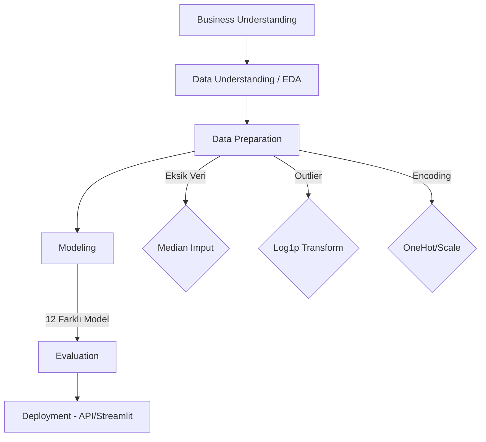

# ✈️ Airline Passenger Satisfaction Prediction

## 🎯 Proje Amacı
Rekabetçi havacılık sektöründe müşteri memnuniyetini proaktif olarak tahmin etmek. Bu sayede memnuniyetsizlik riski taşıyan yolcuları uçuş öncesi tespit edip hızlıca aksiyon alınması hedeflenmektedir. Modelin üreteceği sonuçlar ile kalite iyileştirme bütçesinin doğru kritik noktalara aktarılması planlanmıştır.

## 📂 Dosya Yapısı
```text
final-project/
├── data/
│   ├── raw/                # Orijinal veri seti
│   └── processed/          # Temizlenmiş veri
├── notebooks/
│   └── final_analysis.ipynb  # CRISP-DM analizi
├── models/
│   ├── best_model.joblib     # Nihai Random Forest modeli
│   └── pipeline.joblib       # Preprocessing pipeline (Scaler vb.)
├── app/
│   ├── streamlit_app.py      # Kullanıcı Arayüzü
│   └── api.py                # FastAPI
├── figures/                  # Grafik çıktıları
├── requirements.txt          # Paket listesi
├── README.md                 # Proje açıklaması ve akış
└── report.pdf                # Final danışmanlık raporu
```

## ⚙️ Kurulum ve Kullanım
1. Repoyu bilgisayarınıza klonlayın.
2. Gerekli kütüphaneleri yükleyin:
   ```bash
   pip install -r requirements.txt
   ```
3. Jupyter Notebook'u çalıştırarak veya test verileri ile doğrudan web uygulamasına (Streamlit/FastAPI) geçiş yaparak projeyi çalıştırabilirsiniz.

## 🏆 Model Sonuçları
Optimizasyon hedefi; özellikle yüksek değere sahip business class müşterilerini kaçırmamak üzerine (Recall öncelikli) tasarlanmıştır.

* **En İyi Model**: Random Forest
* **F1-Score**: 0.9536 (Hedef: >= 0.88)
* **ROC-AUC**: 0.9932 (Hedef: >= 0.92)
* **Precision**: 0.9702
* **Recall**: 0.9402

## 🧩 Proje Akışı (CRISP-DM)

